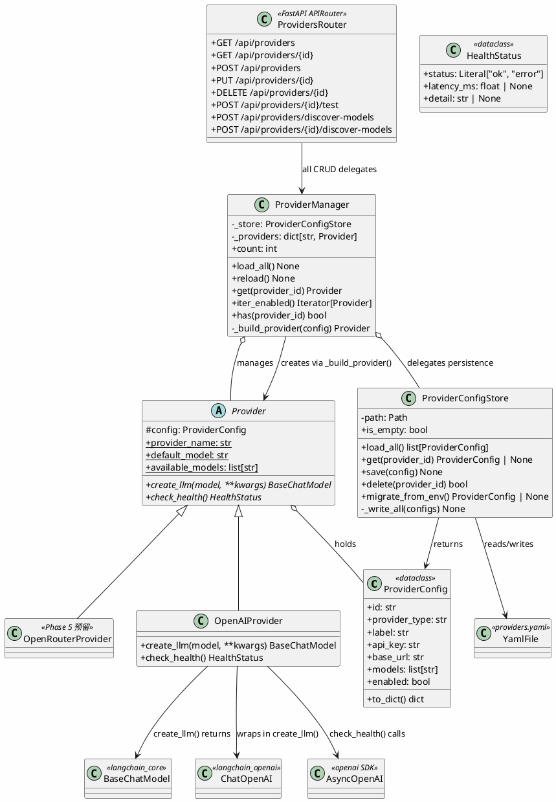

# Project Bay 湾区计划 — 后端 UML 类图



## 包结构

```
api/providers/
├── __init__.py          # Provider, ProviderConfig, HealthStatus
├── store.py             # ProviderConfigStore（YAML 读写）
├── manager.py           # ProviderManager（管理 Provider 生命周期）
└── openai_provider.py   # OpenAIProvider（ChatOpenAI 封装）

api/routes/
└── providers.py         # CRUD + 连接测试 + 模型发现路由

api/server.py            # 应用工厂：初始化 ProviderManager
api/health.py            # 健康检查：聚合多 provider 状态
```

## 核心数据流

```
providers.yaml
     ↓ (读取)
ProviderConfigStore.load_all()
     ↓ (list[ProviderConfig])
ProviderManager.load_all()
     ↓ (过滤 enabled → 创建实例)
ProviderManager._providers: dict[str, Provider]
     ↓
Chat 路由 / Health 路由 → ProviderManager.get(id) → Provider.create_llm(model)
```
