# 技能模块 — Tool / Skill 体系

```plantuml
@startuml

' ===== 样式设置 =====
skinparam classAttributeIconSize 0
skinparam backgroundColor #FEFEFE

' ===== 基类 =====

class SkillBase <<BaseTool>> {
  # client: SharedAPIClient | None
  + _load_doc() str
}

class BaseTool <<langchain_core>> {
  + name: str
  + description: str
  + args_schema: BaseModel
  + _run() str
  + {abstract} _arun() str
}

class SharedAPIClient {
  - _session: requests.Session
  - _uapi: UapiClient | None
  - _todoist: TodoistAPI | None
  - _amap_key: str
  - _uapis_key: str
  - _todoist_token: str
  + uapi: UapiClient
  + todoist: TodoistAPI
  + amap_key: str
  + amap_request(endpoint, params) dict
  + close()
}

' ===== 响应格式 =====

class format_success <<function>> {
  + {static} (data) → {"success": True, "data": ...}
}

class format_error <<function>> {
  + {static} (message) → {"success": False, "error": ...}
}

' ===== 注册中心 =====

class SkillRegistry {
  + {static} get_all_skills() list[BaseTool]
}

' ===== MCP 管理器 =====

class MCPManager {
  - _client: MultiServerMCPClient | None
  - _tools: list[BaseTool] | None
  + {static} init_mcp_tools() list[BaseTool]
  + {static} close_mcp()
}

' ===== 领域分组 =====

package "System" {
  class TimeSkill
  class RunPythonSkill
}

package "Todoist" {
  class TodoAddSkill
  class TodoListSkill
  class TodoCompleteSkill
  class TodoUpdateSkill
  class TodoDeleteSkill
  class TodoQuerySkill
  class TodoListProjectsSkill
  class TodoUncompleteSkill
}

package "Map (高德)" {
  class NearbySearchSkill
  class GeocodeSkill
  class TransitRouteSkill
  class CyclingRouteSkill
  class FuzzyAddressSkill
}

package "Network" {
  class WeatherSkill
  class SmartSearchSkill
  class WebScraperSkill
  class HolidayCalendarSkill
  class ImageUnderstandSkill
}

package "Files" {
  class FileOperationsSkill
  class PDFReaderSkill
  class DocReaderSkill
}

package "Development" {
  class SyntaxCheckerSkill
  class CodeQualitySkill
  class UnitTestSkill
  class DebuggerSkill
}

package "Interaction" {
  class AskUserQASkill
  class AskUserSingleChoiceSkill
  class AskUserMultiChoiceSkill
}

package "Entertainment" {
  class AnswerBookSkill
  class TarotSkill
}

package "Bilibili" {
  class BilibiliDownloadSkill
  class BilibiliSetCookieSkill
}

package "Memory CRUD" {
  class ReadMemoriesSkill
  class CreateMemorySkill
  class UpdateMemorySkill
  class DeleteMemorySkill
  class MergeMemoriesSkill
}

class TaskTrackerSkill
class CallSubAgentSkill

' ===== 领域内部依赖 =====

class TodoAPIHelper {
  - _api: TodoistAPI
  + get_project_id(name) str | None
  + get_project_name(id) str
  + parse_date(date_str) datetime | None
  + format_due_date(task) str | None
}

class BilibiliDownloader {
  - cookie: str
  - output_dir: Path
  + run(url, quality) VideoInfo
  - _fetch_video_info(url, quality) VideoInfo
  - _download_video(video)
  - _merge(video) str
  - _extract_cover_frame(video) str
}

class VideoInfo <<pydantic BaseModel>> {
  + url: str
  + title: str
  + quality_id: int
  + video_url: str
  + audio_url: str
  + is_durl: bool
  + part_number: int
  + output_path: str
  + cover_path: str
  + get_quality_name() str
}

class MapAPI {
  + {static} parse_poi_response(data) dict
  + {static} parse_transit_response(data) dict
  + {static} parse_cycling_response(data) dict
}

' ===== 外部依赖 =====

class MultiServerMCPClient <<langchain_mcp>> {
}

class TodoistAPI <<todoist_api_python>> {
}

class UapiClient <<uapi>> {
}

class requests.Session <<requests>> {
}

' ===== 关系 =====

SkillBase -|> BaseTool : extends

SkillBase o-- SharedAPIClient : 持有（共享）

SkillRegistry --> SkillBase : 创建全部实例
SkillRegistry --> SharedAPIClient : 单例传给每个 skill

MCPManager --> MultiServerMCPClient : 连接 word MCP server

' 领域技能继承 SkillBase
TimeSkill -|> SkillBase
RunPythonSkill -|> SkillBase

TodoAddSkill -|> SkillBase
TodoListSkill -|> SkillBase
TodoistAPI <.. TodoAPIHelper : 封装

NearbySearchSkill -|> SkillBase
GeocodeSkill -|> SkillBase
MapAPI <.. NearbySearchSkill : 解析响应

WeatherSkill -|> SkillBase
SmartSearchSkill -|> SkillBase
WebScraperSkill -|> SkillBase

FileOperationsSkill -|> SkillBase
PDFReaderSkill -|> SkillBase

SyntaxCheckerSkill -|> SkillBase
CodeQualitySkill -|> SkillBase

AskUserQASkill -|> SkillBase

AnswerBookSkill -|> SkillBase
TarotSkill -|> SkillBase

BilibiliDownloadSkill -|> SkillBase
BilibiliDownloadSkill --> BilibiliDownloader : 创建下载器
BilibiliDownloader --> VideoInfo : 返回

ReadMemoriesSkill -|> SkillBase
CreateMemorySkill -|> SkillBase

TaskTrackerSkill -|> SkillBase
CallSubAgentSkill -|> SkillBase

format_success <.. SkillBase : _run 返回
format_error <.. SkillBase : _run 返回

@enduml
```



## 包结构

```
skills/
├── __init__.py                  # get_all_skills() 注册中心
├── base.py                      # SkillBase, SharedAPIClient, format_success/error
├── mcp.py                       # MCP 工具管理器（Word 文档编辑）
│
├── system/                      # 系统级
│   ├── SKILL.md
│   ├── skill_time.py
│   └── skill_python.py
│
├── todo/                        # Todoist 任务管理（8 个 skill）
│   ├── SKILL.md
│   ├── todo_base.py             # TodoAPIHelper
│   └── skill_*.py
│
├── map/                         # 高德地图（5 个 skill）
│   ├── SKILL.md
│   ├── map_api.py               # 响应解析工具
│   └── skill_*.py
│
├── network/                     # 网络服务（5 个 skill）
│   ├── SKILL.md
│   ├── browser_manager.py
│   └── skill_*.py
│
├── files/                       # 文件操作（3 个 skill）
│   ├── SKILL.md
│   └── skill_*.py
│
├── development/                 # 开发辅助（4 个 skill）
│   ├── SKILL.md
│   └── skill_*.py
│
├── interaction/                 # 用户交互（3 个 skill）
│   ├── SKILL.md
│   └── skill_*.py
│
├── entertainment/               # 娱乐（2 个 skill）
│   ├── SKILL.md
│   └── skill_*.py
│
├── bilibili/                    # B 站（2 个 skill）
│   ├── SKILL.md
│   ├── downloader.py            # BilibiliDownloader
│   ├── models.py                # VideoInfo
│   └── skill_*.py
│
├── memory/                      # 记忆 CRUD（5 个 skill）
│   ├── SKILL.md
│   └── skill_*.py
│
├── task/                        # 任务跟踪
│   ├── SKILL.md
│   └── skill_tracker.py
│
└── sub_agent/                   # 子 Agent
    ├── SKILL.md
    └── skill_call_sub_agent.py
```

## Skill 生命周期

```
Server Startup
  ├─ get_all_skills()
  │    └─ 每个 Skill 注入 SharedAPIClient（单例）
  ├─ init_mcp_tools()
  │    └─ 从 YAML 配置加载 MCP 工具
  └─ tools = native + mcp

Every Chat Turn
  └─ Agent 调用: skill._run(**args)
       ├─ get_doc=True  → 读取 SKILL.md
       └─ 正常执行 → format_success / format_error
```
