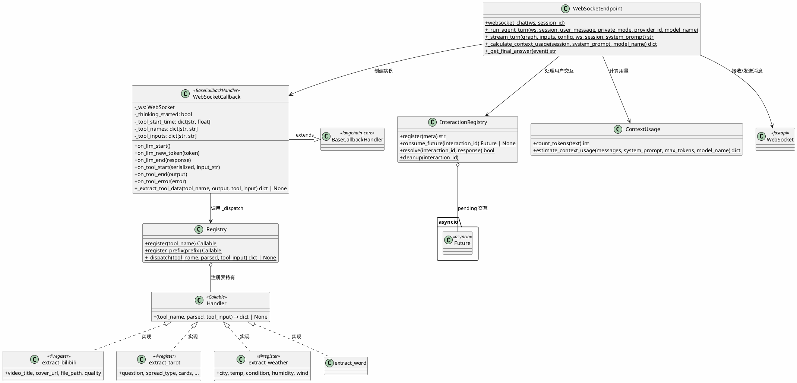

# WebSocket 层 — 实时对话与工具回调



## 包结构

```
api/
├── routes/
│   └── chat.py               # WebSocket 端点 + Agent 编排
├── callbacks/
│   ├── websocket_callback.py  # WebSocketCallback（LangChain → JSON 推送）
│   └── tool_extractors.py     # 工具提取器注册表 + 各工具 Strategy
├── interaction.py             # 用户交互注册表（ask_user 挂起/唤醒）
└── context_usage.py           # token 计数与上下文估算
```

## WebSocket 消息流

```
Client → /ws/chat/{session_id}
  │
  ├─ "chat"  → _run_agent_turn()
  │              ├─ WebSocketCallback.on_llm_start()       → "thinking_start"
  │              ├─ WebSocketCallback.on_llm_new_token()   → "token"
  │              ├─ WebSocketCallback.on_llm_end()         → "thinking_end"
  │              ├─ WebSocketCallback.on_tool_start()      → "tool_start"
  │              ├─ WebSocketCallback.on_tool_end()         → "tool_end" (+ tool_data)
  │              ├─ WebSocketCallback.on_tool_error()      → "tool_error"
  │              └─ ...                                     → "answer" + "done" + "context_usage"
  │
  ├─ "cancel" → cancel agent_task
  ├─ "ping"   → "pong"
  └─ "user_response" → InteractionRegistry.resolve()
```
